# FP_vs_1Bit_InductionHeadCircuit
Comparing the full-precision Query, Keys, and Values matrices with their 1-bit counterparts in a two-layer, attention-only transformer trained on a synthetic copying task.

## Induction Heads and Induction Scores:
[Induction heads](https://arxiv.org/abs/2209.11895) are types of attention heads specialised in recognising patterns from previous instances and acting upon them in future predictions. They can identify and respond to previously encountered patterns through various mechanisms, one of the clearest form being hard copying. For example, given a sequence of tokens: g&icuwpxzohbcepeaikyfeejxaps&, when an induction head encounters the final token `&`, it searches for the token that appeared after the previous copy of this token, which is `i`, and copies it to predict as the next token. Induction heads are hypothesised to be the primary drivers of in-context learning capabilities in Transformer models. Furthermore, the circuitry of induction heads has become a guiding evaluation in model architecture design, recently employed to benchmark the copying capabilities of the Mamba architecture. Personally, I view this as a good indication of how exploring the circuits and modules within neural networks will steer the development of new architectures.

[Induction Score](https://www.neelnanda.io/mosaic) represents the average attention weight each head assigns to the token following the previous instance of the current token.

## Task:
In our experiments, we constructed a synthetic copying task to assess the effectiveness of induction heads in hard copying. Our dataset largely follow the methodology outlined in ([Daniel Y. Fu et al., 2022](https://arxiv.org/pdf/2212.14052.pdf)). We generated random sequences from the alphabet, introducing a special token `&` at various starting points of the sequence. This special token is then repeated at the end of the sequence, and the task for the model is to predict the next token as the one following the previous occurrence of the special token.
For more details check the `prepare_dataset.py`

## Experiments:
We substituted the Query, Key, and Value linear layers with BitLinear layers, as outlined in [Hongyu Wang et al., 2023's BitNet](https://arxiv.org/pdf/2310.11453.pdf). Our aim was to understand the behavioural differences of induction heads in BitLinear layers in contrast to those in full-precision (FP) linear layers, across various configurations. To this end, we constructed a range of induction head circuits within two-layer, attention-only transformers, utilising every possible combination of the following:

- embed_sizes=(64 128 256 512 768 1024 2048 8192)
- num_heads=(2 4 8 16)
- norms=('pre_norm' 'post_norm' 'no_norm')
- positions_encodings=('learnable' 'trigonometric' 'no_pos')

## Results
The heatmaps below display the average induction scores across all training samples for various combinations of embed sizes and num heads. The first two rows highlight the effects of positional encoding and their averages across different normalisation techniques (norms) and the training samples. The last two rows focus on the impact of norms, averaged across different positional techniques and the training samples.

Note that this experiment was conducted once with a single seed, due to the high number of runs required. However, averaging across more than 5k training samples and various norms and positional techniques may reduce the noise in the reported results. We also provide heatmaps for eval set of 500 samples in the `assests folder`.

<div style="text-align:center;">

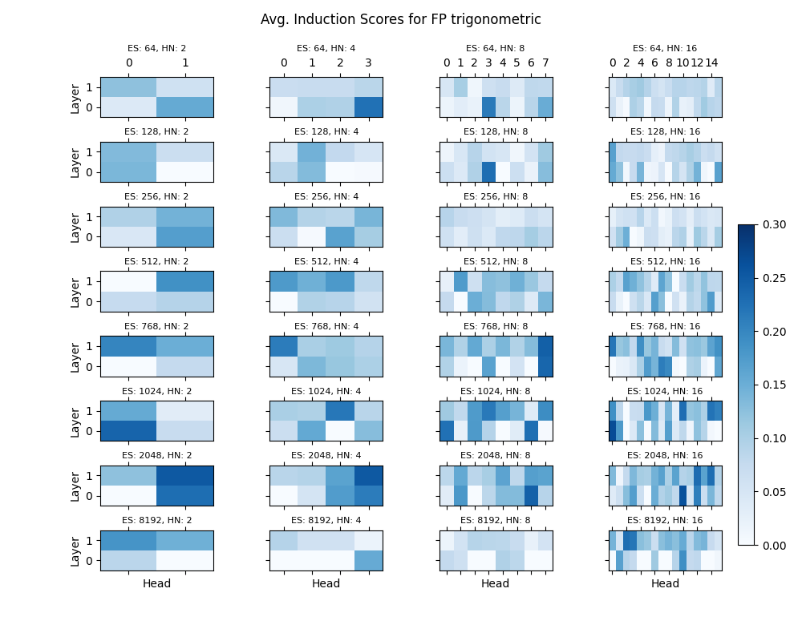
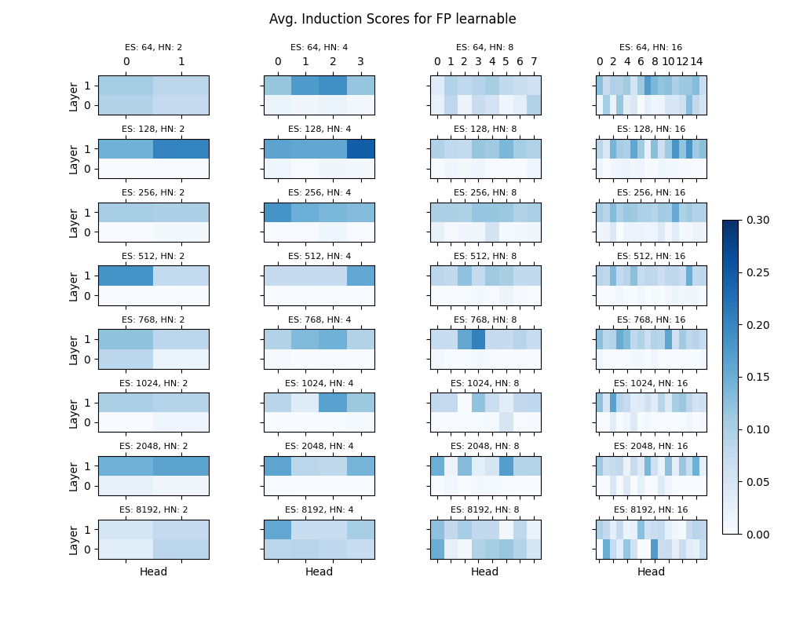
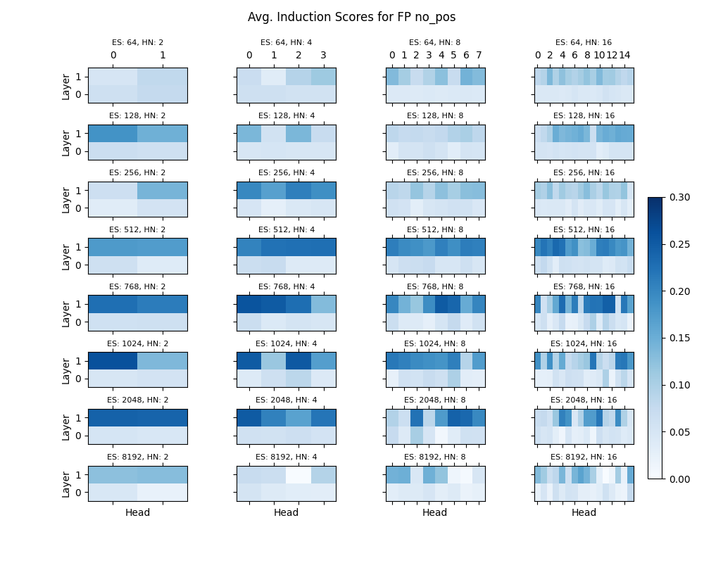

<br>

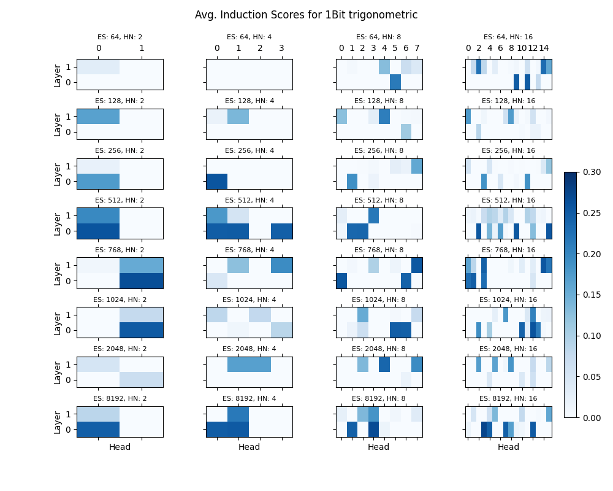
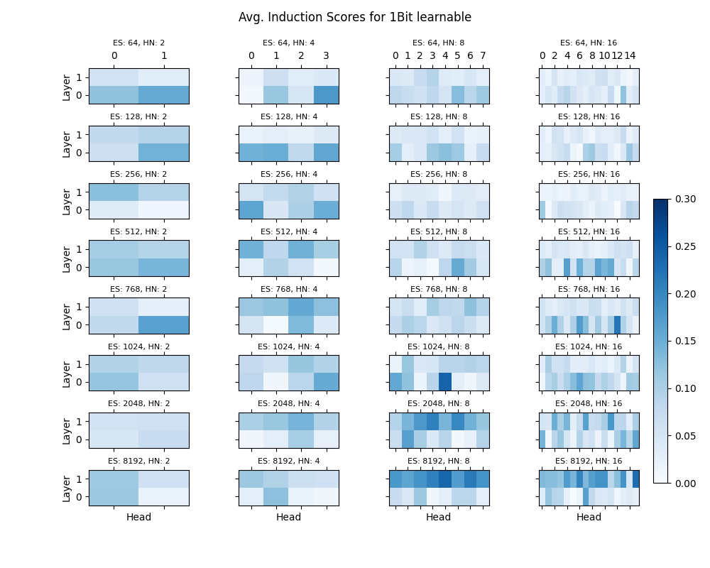
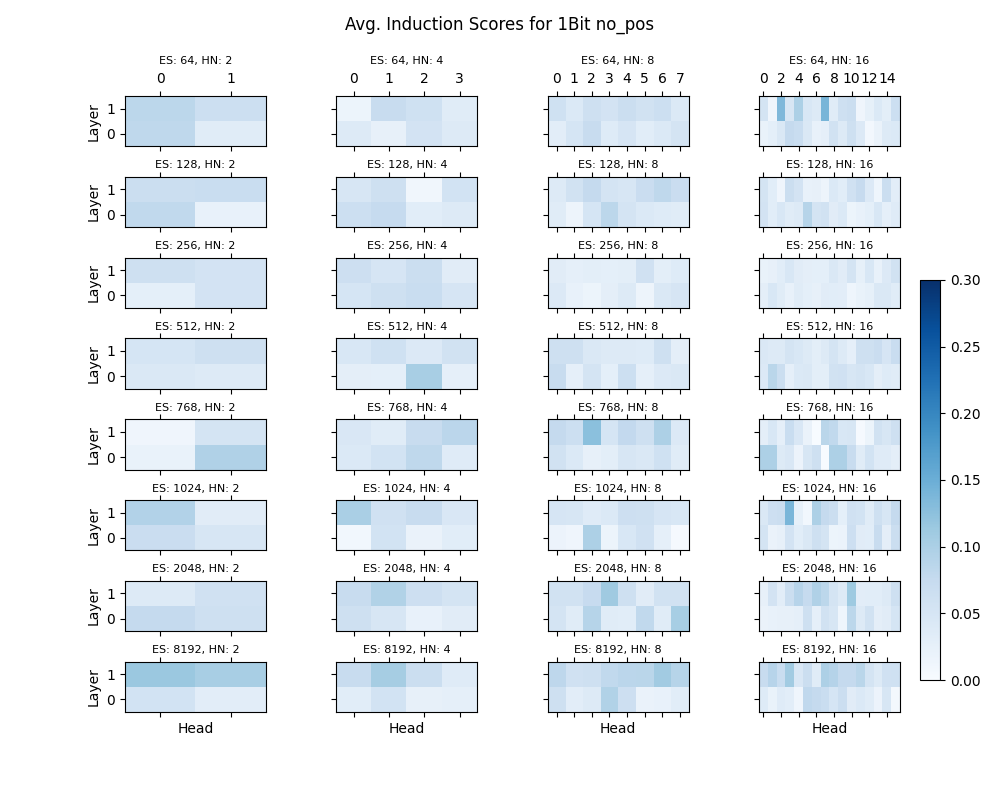

<br>

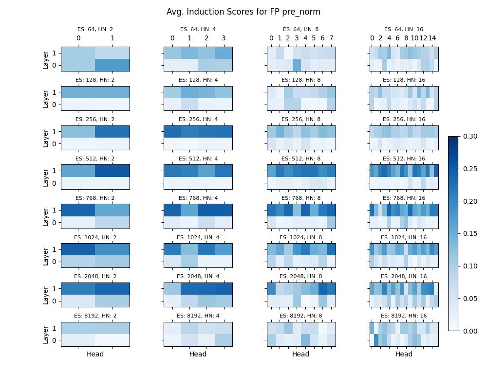
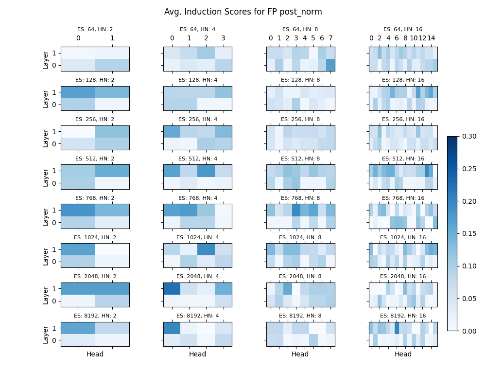
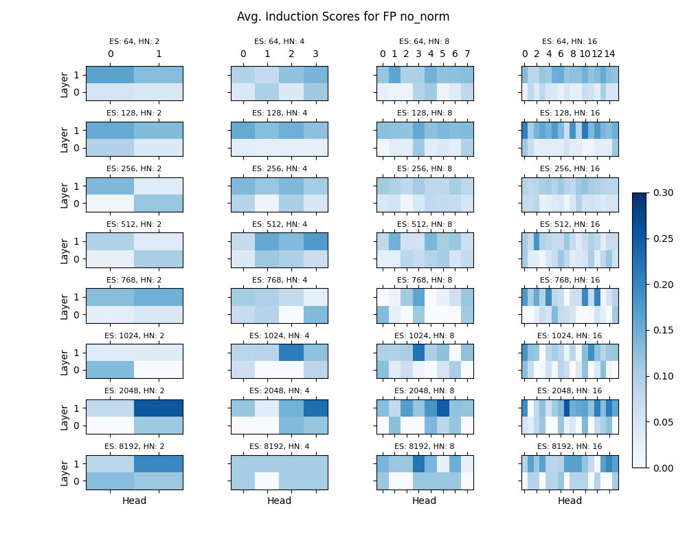

<br>

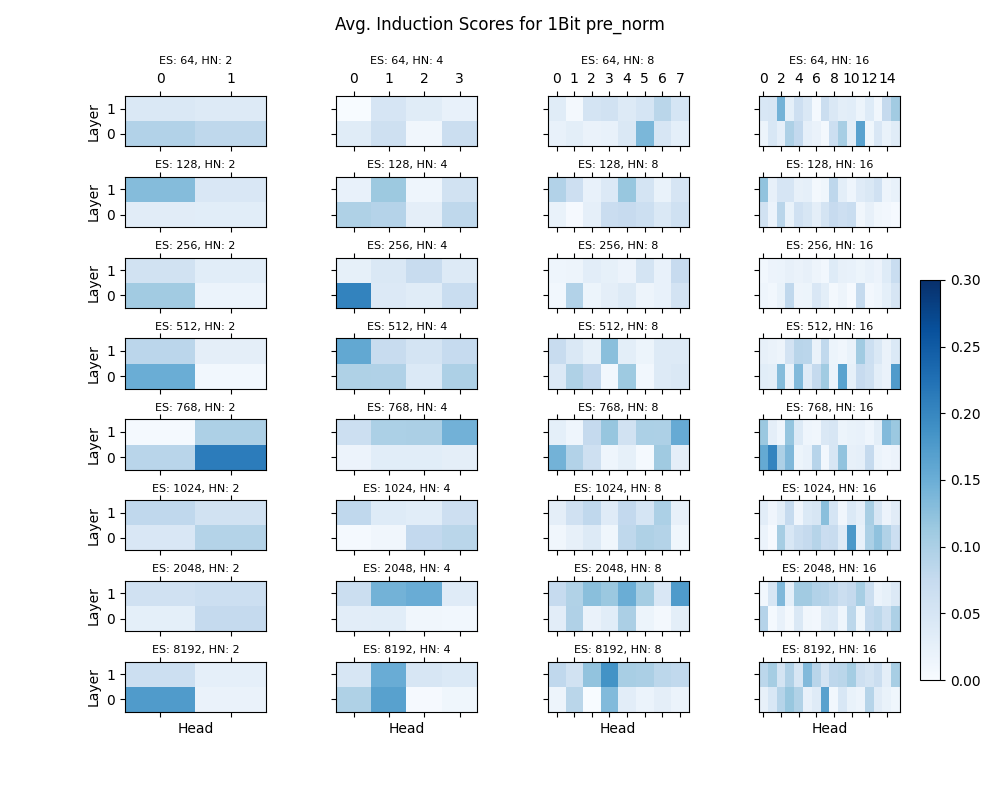
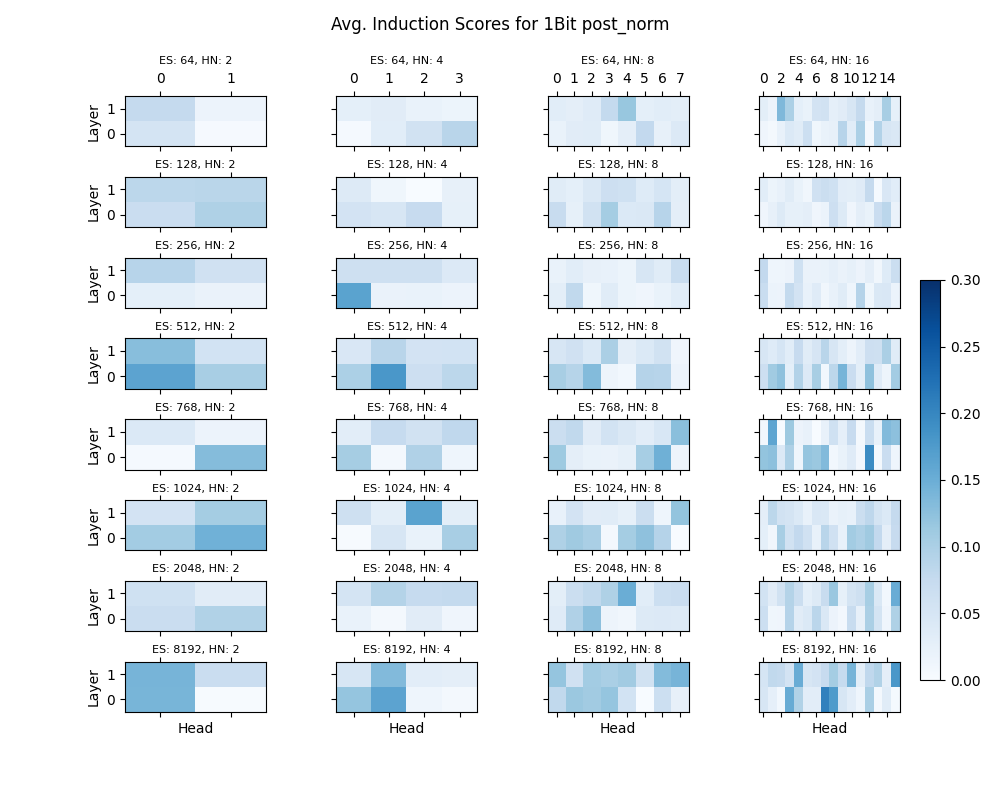
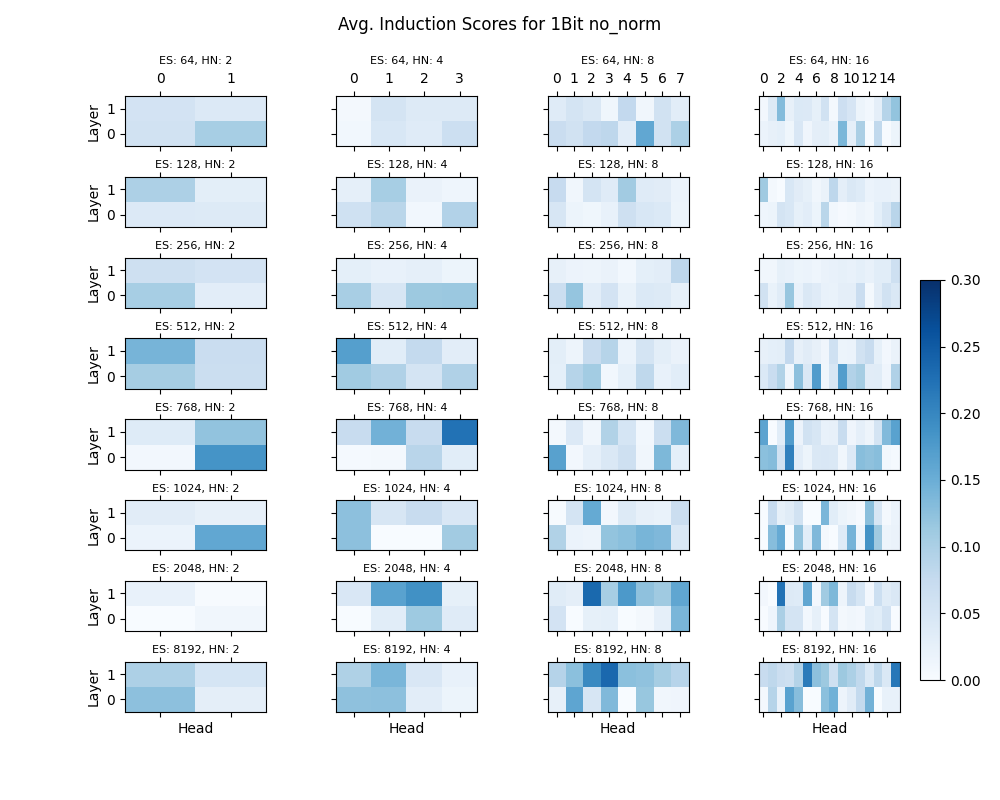

</div>


## code:

#### Environment:
```
conda env create -f environment.yml
conda activate ihc_env
```
#### Train an induction circuit
config.ini contains models and training configs, feel free to tweak, then run:
```
python train.py -c config.ini --embed_size "$embed_size" --num_head "$head" --pos_embed "$pos_embed" --norm_mode "$norm" --seed "$seed"
```

